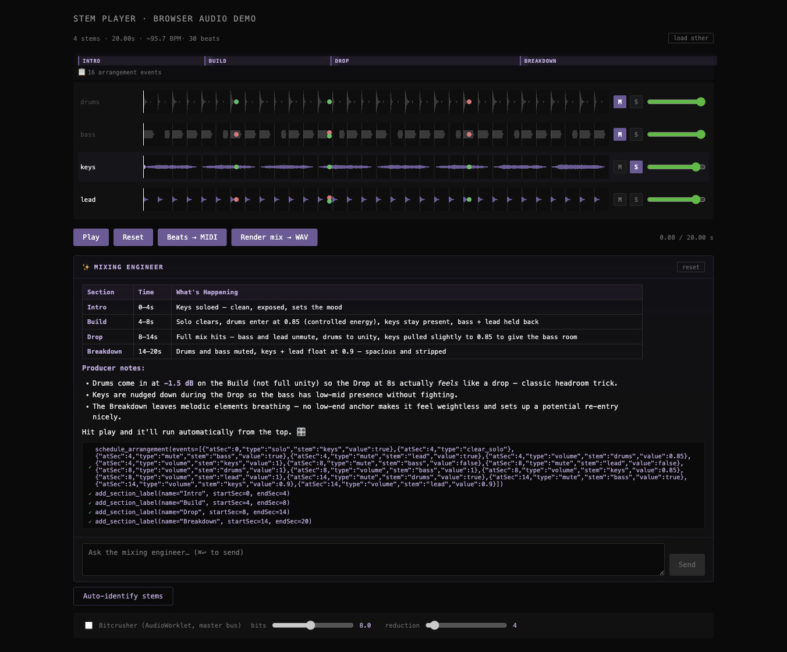

# Stem Player

> A browser-based multi-stem audio player with an **AI mixing engineer** that
> can analyze your stems, write time-based arrangements, apply per-stem audio
> processing, and render the result to WAV — all with sample-perfect transport.

**🌐 Live: [stem-player-demo.vercel.app](https://stem-player-demo.vercel.app)**



---

## What it does

Drop a folder of audio stems (drums, bass, keys, lead — or 12 stems from a Suno
export). The app:

- Plays them all in **sample-perfect sync** via Web Audio (`start(ctx.currentTime + 50ms)` lookahead)
- Renders each stem's waveform on a Retina-aware canvas
- Detects beats with energy-based onset detection, estimates tempo from the median inter-beat interval
- Persists per-file mix state in localStorage (SHA-256-keyed) — reload, drop the same file, your mix returns

Then talk to the **mixing-engineer agent**:

- *"Build me a downtempo lo-fi arrangement with intro, build, drop, breakdown."*
- *"Make this sound like a festival drop."*
- *"Underwater dream — lowpass everything, push reverb, pan wide."*

The agent is Claude Sonnet 4.6 with **18 tools** mapped onto a real audio engine.
It schedules time-based mix automation, applies per-stem FX (filter / pan /
reverb send / master bitcrusher), and adds section labels — then auto-plays
the result.

Click **Render mix → WAV** at any point to download the arranged session as a
single mixed file.

---

## Architecture

```
┌─────────────────────────────────────────────────────────────┐
│  React 19 UI                                                │
│  ┌─────────────────────────┐  ┌──────────────────────────┐  │
│  │  Mixer (per-stem rows)  │  │  Mixing-engineer chat    │  │
│  │  - waveforms (canvas)   │  │  - streaming markdown    │  │
│  │  - mute/solo/volume     │  │  - tool-use trace        │  │
│  │  - automation event dots│  │  - 6 demo prompts        │  │
│  │  - loop region overlay  │  │                          │  │
│  │  - section labels       │  │                          │  │
│  └─────────────────────────┘  └──────────────────────────┘  │
│             │                            │                  │
│             ▼                            ▼                  │
│   AudioEngine                   AgentEngine (client loop)   │
│   - per-stem chain:             - holds conversation        │
│     src → filter → pan → gain   - executes tool calls       │
│              → reverbSend       - applies actions to engine │
│   - master crusher (worklet)    - posts tool_results back   │
│   - synthetic IR reverb bus     - auto-play on arrangement  │
│   - Scheduler (rewind-aware)    │                           │
└─────────────────────────────────┼───────────────────────────┘
                                  │ /api/agent (SSE)
┌─────────────────────────────────▼───────────────────────────┐
│  Vercel edge fns                                            │
│  - /api/agent       Claude Sonnet, 18 tools, streaming      │
│  - /api/auto-name   Claude Haiku, infers stem types from    │
│                     spectral features                       │
└─────────────────────────────────────────────────────────────┘
```

## Agent toolkit (18 tools)

| Layer | Tools |
|---|---|
| **Inspect** | `describe_session` (returns stems + FX state + arrangement + loop + sections) |
| **Mix** | `set_volume`, `mute_stem`, `unmute_stem`, `solo_stem`, `clear_solo` |
| **Per-stem audio processing** | `set_stem_filter` (LP/HP/BP), `set_stem_pan`, `set_stem_reverb`, `clear_stem_fx` |
| **Master FX** | `set_bitcrusher` |
| **Transport** | `play`, `stop`, `rewind` |
| **Arrangement** | `schedule_arrangement`, `clear_arrangement`, `get_arrangement` |
| **Loop** | `set_loop_region`, `clear_loop_region` |
| **Sections** | `add_section_label`, `clear_sections` |

## Module layout

| File | Responsibility |
|---|---|
| `src/audio.ts` | `AudioEngine` — N-stem sync, per-stem FX chain, master crusher, synthetic-IR reverb bus, loop region |
| `src/automation.ts` | `Scheduler` — fires automation events as the playhead crosses them; rewind-aware |
| `src/agent-tools.ts` | 18 tool definitions + handlers; `executeTool()` mutates engine + React state |
| `src/agent-engine.ts` | Client agent loop: stream → tools → results → repeat (multi-turn) |
| `src/AgentChat.tsx` | Chat UI: streaming markdown, live tool-use trace, demo prompt chips |
| `src/beats.ts` | `detectBeats()` (energy onset) + `estimateTempo()` (median IBI, folded to 70-180 BPM) |
| `src/midi.ts` | Standard MIDI File Format-0 writer (proper VLQ encoding, tempo meta, EOT) |
| `src/render.ts` | `renderMix()` — `OfflineAudioContext` mirrors the live graph, applies automation, emits PCM 16-bit WAV |
| `src/persist.ts` | localStorage adapter, SHA-256 file-hash keying |
| `src/analysis.ts` | RMS, spectral centroid, peak count, ZCR — used by auto-name |
| `src/demo-stems.ts` | Procedural drums/bass/keys/lead via `OfflineAudioContext` (8 bars at 96 BPM, C minor) |
| `public/bitcrusher-processor.js` | AudioWorklet processor (k-rate AudioParams) |
| `api/agent.ts` | Vercel edge fn — Claude streaming + tool-use loop |
| `api/auto-name.ts` | Vercel edge fn — Claude Haiku stem-type inference |

## What to try

In the agent chat, click any of the 6 demo prompt chips (or type your own):

| Chip | What it does |
|---|---|
| 🎚️ **Downtempo lo-fi arrangement** | Schedules 4 sections (intro/build/full/breakdown), per-stem FX, drum lowpass for vinyl warmth |
| 🔥 **Festival drop** | Build for 4s, then everything-in with crispy drums and lead pushed up |
| 🌫️ **Underwater dream** | Lowpass everything to 600Hz, heavy reverb on lead/keys, wide pan |
| 🎙️ **Vocals-only breakdown** | Mid-section solo → full mix transitions with section labels |
| 📞 **Telephone effect** | Bandpass filter at 1500Hz Q=4 on the lead, with reverb |
| 🔁 **Loop the chorus** | Calls `describe_session`, picks the most energetic 2s, sets loop region |

Then hit **Render mix → WAV** to download the arranged session as a single audio file.

## Run it

```bash
npm install
npm run dev          # Vite on :5174 (frontend only, no AI endpoints)
npm test             # Vitest — 34 tests across beats, midi, persist, automation, render
npm run build        # tsc + vite build
```

For the AI endpoints to work locally:

```bash
npm i -g vercel
echo "ANTHROPIC_API_KEY=sk-ant-..." > .env
vercel dev           # serves frontend + api/* edge functions
```

## Deploy to Vercel

```bash
vercel link
vercel env add ANTHROPIC_API_KEY production
vercel deploy --prod
```

## Tests

```bash
npm test
```

**34 tests** across 5 files:

- `beats.test.ts` — energy onset, refractory ≥150ms, tempo estimation, IBI median
- `midi.test.ts` — RIFF/MThd/MTrk header bytes, tempo meta, note pairing, EOT
- `persist.test.ts` — localStorage round-trip, key namespacing, corruption handling
- `automation.test.ts` — Scheduler firing order, dedup, rewind detection, all event types
- `render.test.ts` — WAV encoder header, sample-rate field, channel count, sample clamping, stereo interleaving

The test suite has caught real bugs — the beat-detection refractory was being
rounded *down* to 139ms instead of *up* to 150ms (`Math.floor` → `Math.ceil`
in `beats.ts:25`).

## License

MIT
